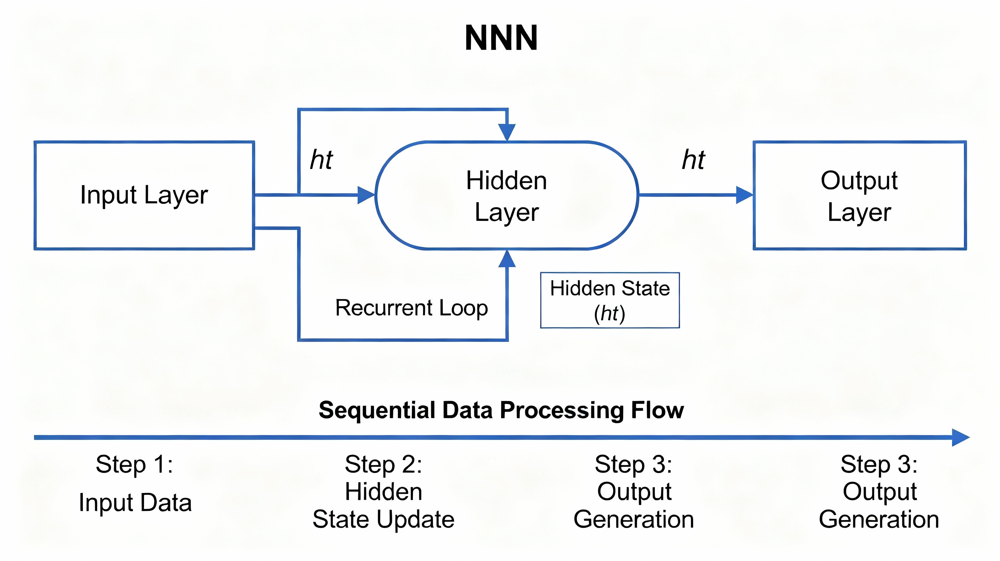
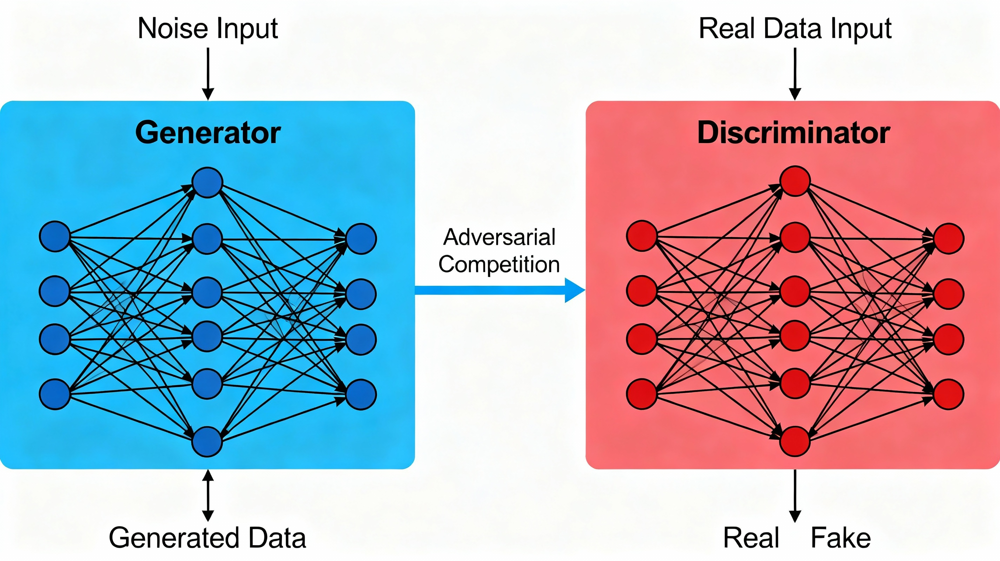
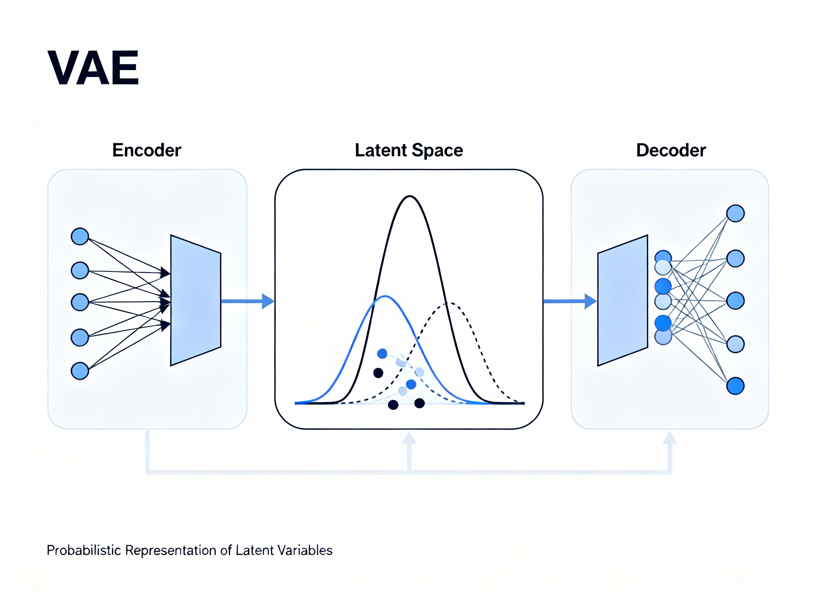
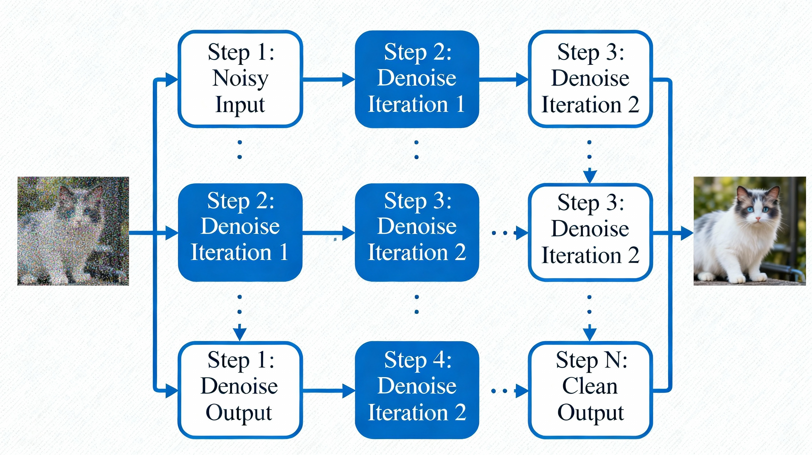
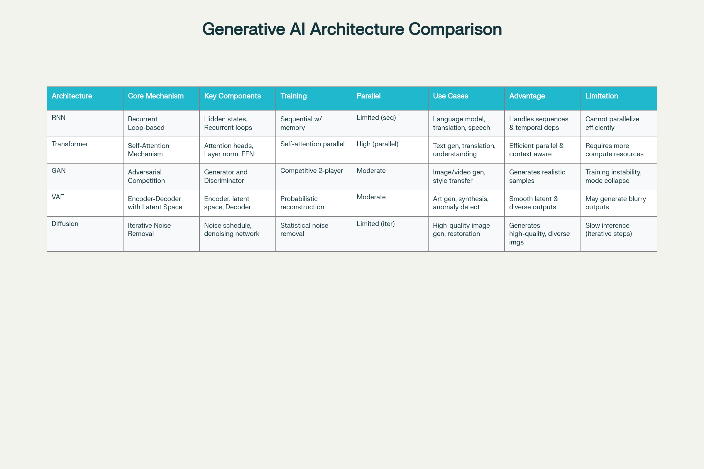
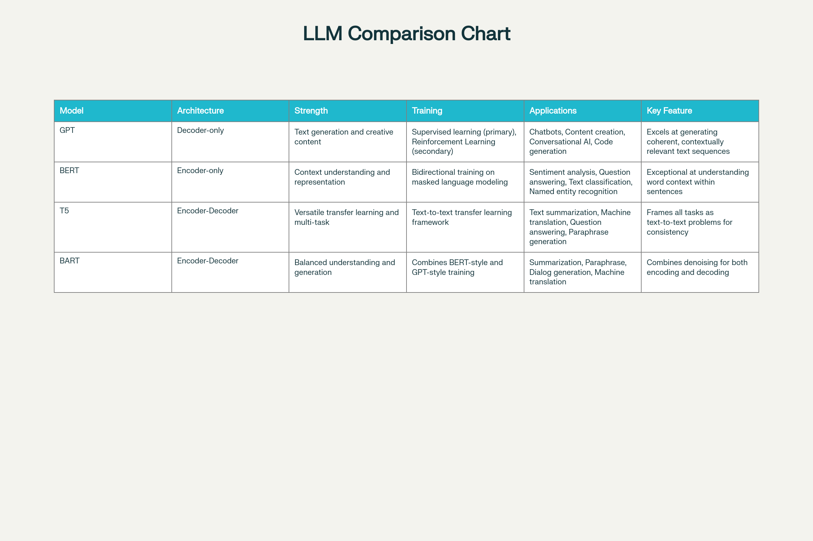

## Generative AI Architecture: Module 1 - Comprehensive Guide

### Overview

Generative AI architectures represent sophisticated deep learning models designed to generate new, high-quality content such as text, images, audio, and other data types based on patterns learned from training data. These architectures understand underlying patterns and structures within existing data and apply this understanding to produce novel, contextually relevant outputs. The field encompasses multiple distinct architectural approaches, each with unique mechanisms, training methodologies, and optimal applications.

### Core Generative AI Architectures

The five primary generative AI architectures form the foundation of modern content generation systems:

Taxonomy and Characteristics of Generative AI Architectures

#### 1. Recurrent Neural Networks (RNNs)

RNNs represent a fundamental architecture for processing sequential and time-series data with natural ordering or time-based dependencies. The defining characteristic of RNNs is their **loop-based design**, which distinguishes them fundamentally from regular neural networks.

**Core Mechanism**: RNNs employ recurrent loops built into their structure, enabling them to maintain and leverage memory of previous inputs to influence current processing and output generation. This memory mechanism is crucial for tasks involving sequences, as it allows the network to understand context by retaining information across sequential steps.

**Key Components**:

- Hidden state that carries information from previous time steps
- Recurrent connections that create feedback loops
- Weight matrices for input-to-hidden and hidden-to-hidden transformations

**Training Approach**: RNN fine-tuning involves adjusting weights and the structure of the recurrent network to align with specific tasks or datasets. The training process uses backpropagation through time (BPTT), which propagates errors backward through the temporal sequence.

**Applications**:

- Natural language processing and language modeling
- Machine translation between languages
- Speech recognition systems
- Image captioning and visual description generation

**Advantages**: Excellent for sequential dependencies and temporal relationships; naturally captures long-term patterns in ordered data.

**Limitations**: Suffers from vanishing gradient problems; cannot parallelize efficiently due to sequential processing requirements.

RNN Architecture with Recurrent Loop Design and Memory Mechanism

#### 2. Transformer Architecture

Transformers represent a paradigm shift in deep learning, particularly for sequential data processing. These deep learning models can translate text and speech in near real-time by processing data through multiple layers in a unidirectional flow—from input layer through hidden layers to output layer.

**Core Mechanism**: The transformer architecture is built upon a **self-attention mechanism**, which enables the model to focus on the most important parts of the information it processes. This selective focus allows the model to concentrate on specific segments of the input sequence concurrently, enabling massive parallelization for efficient training.

**Key Components**:

- Multi-head self-attention mechanisms
- Layer normalization
- Feed-forward networks
- Positional encoding for sequence information

**Attention Mechanism**: The self-attention mechanism allows each position in the sequence to attend to all other positions, learning which parts are most relevant. This differs fundamentally from RNNs' sequential approach, allowing transformers to process entire sequences in parallel.

**Training Approach**: Transformer fine-tuning differs significantly from RNN fine-tuning. The pretrained transformer model remains largely intact, with fine-tuning typically involving training only the final output layers for specific tasks. The self-attention mechanisms and other core layers usually remain fixed during adaptation to new domains.

**Generative Pretrained Transformer (GPT)**: GPT exemplifies the power of the transformer architecture for generative tasks. It is trained to predict and generate text sequences based on patterns learned from training data. Despite not explicitly modeling underlying data distribution, its capacity to produce text mirroring its training data distribution and its versatility in fine-tuning confirm its role as a generative model.

**Advantages**: Enables parallel processing for efficiency; superior context understanding; scales well to very large datasets.

**Limitations**: Computationally expensive; requires substantial memory; needs large training datasets to perform optimally.

Transformer Architecture with Self-Attention Mechanism and Parallel Processing

#### 3. Generative Adversarial Networks (GANs)

GANs represent a unique approach to generative modeling through competitive training between two neural networks. This architecture consists of two submodels working in an adversarial, or competitive, process.

**Core Mechanism**: The generator creates fake samples and sends them to the discriminator. The discriminator checks their authenticity by comparing them with real samples from the domain dataset and assigns a probability score to each sample, indicating how likely the sample is to be authentic. This adversarial process continues like a friendly competition, with the generator striving to make outputs look increasingly realistic while the discriminator learns to distinguish between real and fake, with both entities improving their respective outputs.

**Architecture Components**:

- **Generator**: Creates synthetic samples from random noise
- **Discriminator**: Evaluates authenticity and provides feedback
- Adversarial loss function driving the competition

**Training Approach**: GANs employ a competitive training approach where the generator and discriminator engage in continuous feedback loops. The generator aims to fool the discriminator, while the discriminator aims to become better at detection. This creates a dynamic optimization process.

**Specific Use Cases**: GANs are particularly useful for image and video generation, style transfer, image-to-image translation, and creating realistic synthetic data.

**Advantages**: Generates highly realistic and detailed samples; excellent for visual content; can produce diverse outputs.

**Limitations**: Training instability and potential mode collapse; difficult to train; convergence is not guaranteed; may generate low-quality samples if not properly tuned.

GAN Architecture with Generator and Discriminator Adversarial Competition

#### 4. Variational Autoencoders (VAEs)

VAEs operate on an encoder-decoder framework, representing a probabilistic approach to generative modeling. This architecture focuses on learning underlying patterns within input data to create new samples with similar characteristics.

**Core Mechanism**: The encoder network compresses input data into a simplified abstract space (latent space) that captures essential characteristics. The decoder network then uses this condensed information to recreate the original data or generate variations of it.

**Architecture Components**:

- **Encoder**: Compresses input data into latent representation
- **Latent space**: Probabilistic representation capturing data characteristics
- **Decoder**: Reconstructs data from latent representation
- Sampling mechanism from probability distributions

**Data Representation**: VAEs represent data using probability distributions in the latent space, enabling them to produce a range of possible outputs for a given input, reflecting inherent uncertainty in real-world data.

**Training Approach**: The training objective combines reconstruction loss (ensuring decoded output matches input) with KL divergence (ensuring latent distribution matches a prior distribution), creating a probabilistic framework that captures data variability.

**Applications**: VAEs are particularly useful in applications related to art and creative design, data synthesis, anomaly detection, and generating variations of existing content.

**Advantages**: Smooth latent space allowing interpolation; produces diverse, varied outputs; interpretable latent representations.

**Limitations**: Often generates blurry or less sharp outputs compared to GANs; may lose fine details during compression.

VAE Architecture with Encoder-Decoder Framework and Latent Space Representation

#### 5. Diffusion Models

Diffusion models represent a probabilistic generative approach based on a novel principle: learning to remove noise. A diffusion model is trained to generate images by learning how to remove noise or reconstruct examples from its training data that have been distorted beyond recognition.

**Core Mechanism**: The model operates in reverse of a natural process. During training, noise is progressively added to clean images until they become unrecognizable. The diffusion model learns to reverse this process—progressively removing noise to reconstruct meaningful images from pure noise.

**Architecture Components**:

- Noise schedule determining noise levels over time
- Denoising neural network predicting noise at each step
- Iterative denoising process from noise to clean output

**Generative Process**: Depending on the prompt, a diffusion model can generate highly creative images based on the statistical properties of its training data. The iterative refinement process allows for high-quality, diverse output generation.

**Training Approach**: Diffusion models depend on statistical properties. The training objective involves predicting the noise component at each diffusion step, enabling the model to learn the underlying data distribution through gradual denoising.

**Applications**: Used to generate high-quality images from noisy or low-quality inputs, such as restoring old, distorted photographs; also used for super-resolution, inpainting, and creative content generation.

**Advantages**: Generates very high-quality, diverse, and realistic images; stable training process; no mode collapse issues.

**Limitations**: Slow inference due to iterative denoising steps; computationally expensive during generation; requires many denoising steps.

Diffusion Model Architecture with Iterative Noise Removal and Denoising Steps

### Training Approaches Comparison

Comprehensive Comparison of Generative AI Architectures

The training methodologies differ significantly among the architectures:

- **RNNs** use sequential processing with loop-based design and backpropagation through time
- **Transformers** utilize self-attention mechanisms enabling parallel processing and efficient training
- **GANs** employ competitive training where generator and discriminator networks improve iteratively
- **VAEs** adopt a characteristics-based probabilistic approach combining reconstruction and distribution matching
- **Diffusion Models** depend on statistical property learning through progressive noise removal

### Evolution of NLP and Generative AI

The development of generative AI for natural language processing reflects a clear progression of sophistication:

#### Rule-Based Systems (Early Era)

Rule-based systems strictly follow predefined linguistic rules such as grammar. While these systems were precise in their rule execution, they lacked flexibility and could not adapt to exceptions or nuances in language.

#### Machine Learning Approaches (1990s-2000s)

Machine learning approaches employed statistical methods to learn from vast language datasets and make predictions. These approaches were more adaptable than rule-based systems but remained limited in understanding complex language nuances. Statistical models improved on rigidity but required extensive feature engineering.

#### Deep Learning Era (2010s)

Deep learning focused on training artificial neural networks with extensive datasets. It involved many computational units within these networks working together to make more nuanced language interpretations. Deep learning reduced the need for manual feature engineering and captured complex patterns automatically.

#### Transformer Revolution (Late 2010s-Present)

Transformers represent the latest evolution in this progression. The transformer architecture is specifically designed to handle sequential data with a greater ability to understand context and dependencies within language than their predecessors. Transformers have a greater ability to understand context and dependencies within language than their predecessors.

The progression demonstrates increasing capacity to handle complexity, nuance, and parallelization:

| Evolution Stage | Approach | Flexibility | Capability | Limitations |
| :-- | :-- | :-- | :-- | :-- |
| Rule-Based | Predefined rules | Low | High precision | Cannot adapt; no learning |
| Machine Learning | Statistical methods | Moderate | Pattern recognition | Limited context; manual features |
| Deep Learning | Neural networks | High | Complex relationships | Requires large data; slow sequential |
| Transformers | Self-attention | Very high | Context and long-range dependencies | Computationally expensive |

### Generative AI for Natural Language Processing (NLP)

Generative AI architectures enable machines to comprehend human language and generate responses indistinguishable from human generation. They improve language processing by incorporating context awareness, ensuring coherent interactions, and enabling meaningful conversations through predictive analytics and advanced modeling. NLP systems based on generative AI architectures sense feelings and grasp intentions behind words, extending their understanding beyond mere surface-level words.

#### Key NLP Applications

**Machine Translation**: Generative AI architectures significantly enhance accuracy by enabling more precise and context-aware conversions between languages, preserving both meaning and tone.

**Chatbots and Virtual Assistants**: Generative AI architectures enable natural and humanlike conversations with a degree of empathy and personalization, substantially enhancing user experience compared to rule-based systems.

**Sentiment Analysis**: The ability of generative AI architectures to grasp subtle language expressions improves the effectiveness of sentiment analysis, offering deeper insights into user sentiments and emotional content beyond simple positive/negative classification.

**Text Summarization**: These architectures enable recognition of core meaning and significance within documents, resulting in more precise, contextually appropriate summaries while preserving essential information.

### Large Language Models (LLMs)

Large Language Models (LLMs) are foundation models that use AI and deep learning with vast datasets such as websites and books to generate text, translate languages, and create various types of content. They are referred to as large language models due to two key factors: the size of the training dataset, which may reach petabytes, and the billions of parameters—variables defining the model's behavior.

**Parameter Tuning**: These parameters are fine-tuned during training to optimize the model's performance on specific tasks. For example, when the model learns about emotions, a parameter could represent the weights assigned to specific words such as "happy" or "sad."

**Extensive Training Benefits**: The extensive training of LLMs on massive datasets enables them to understand language structures and contexts comprehensively. They capture the nuances of human language, facilitating more natural interactions.

**Core Capabilities**: LLMs are proficient in predicting the next word in a sequence. With their vast resources, LLMs can produce creative content with minimal task-specific training.

Comparison of Major Large Language Models (LLMs)

#### Major LLM Examples and Architectures

**GPT (Generative Pretrained Transformer)**: GPT primarily acts as a decoder, expert at generating text. It excels in tasks where creating coherent and contextually relevant content is crucial, such as chatbots, content creation, and conversational AI.

**BERT (Bidirectional Encoder Representations from Transformers)**: BERT utilizes an encoder-only transformer architecture. It is exceptional at understanding the context of a word within a sentence, which is crucial for nuanced tasks like sentiment analysis and question answering.

**T5 (Text-to-Text Transfer Transformer)**: Models such as BERT and T5 follow an encoder-decoder architecture. They leverage encoding for contextual understanding and decoding to generate text. This versatility makes them well-suited for various NLP tasks including summarization, translation, and question answering.

#### GPT vs. ChatGPT Distinction

While GPT and ChatGPT might sound interchangeable and share similarities, they have important distinctions:

- **GPT** focuses on diverse text generation tasks across multiple domains
- **ChatGPT** focuses specifically on generating natural, conversational exchanges

**Training Differences**:

- **GPT** uses supervised learning predominantly, with less emphasis on conversational aspects
- **ChatGPT** uses a combination of supervised learning and reinforcement learning from human feedback (RLHF)

**Human Feedback Integration**:

- **GPT** does not incorporate feedback from human interactions as part of its learning process
- **ChatGPT** uses RLHF (Reinforcement Learning from Human Feedback) methodology, which uses human feedback to create a reward model that shapes the output toward more conversational, helpful, and safe responses

**Transfer Learning Capability**: LLMs can be pretrained for generic purposes and then fine-tuned with much smaller datasets. For example, LLMs may be trained in generic text classification but then fine-tuned in a retail industry context for categorizing products into groups such as electronics or clothing based on textual descriptions.

**Important Considerations**: While these models can generate authoritative-sounding text across domains, they may also generate information that sounds right but isn't accurate. Practitioners must address potential biases and consider the impact of generated content on society.

### Relationship with Reinforcement Learning

Generative AI models are closely tied to reinforcement learning. Traditional reinforcement learning focuses on how agents like AI systems or robots interact with their environment to maximize rewards. Generative AI models employ reinforcement learning techniques during training to fine-tune and optimize their performance for specific tasks.

This is particularly evident in ChatGPT's use of RLHF, where reinforcement learning shapes model behavior based on human feedback, creating more aligned and useful outputs than supervised learning alone.

### Significance and Applications of Generative AI

Generative AI is becoming increasingly significant across diverse domains and industries. According to Bloomberg Intelligence, generative AI is expected to become a \$1.3 trillion market by 2032, expanding its applications significantly.

#### Content Creation

Generative AI can automate the creation of articles, blog posts, marketing materials, and other written content with contextual relevance and clarity. Visual content creation for entertainment and advertising has also been revolutionized, along with video generation capabilities.

#### Information Condensation

Generative AI can condense long documents and articles, helping readers quickly absorb essential information without reading entire sources.

#### Natural Language Translation

Generative AI makes language translation sound more natural, improving accessibility of content across linguistic boundaries.

#### Enterprise and Analysis Applications

Generative AI systems built on one or more AI models help analyze large datasets, especially in natural language processing tasks. They uncover insights and suggest creative solutions for complex problems.

#### Industry-Specific Applications

**Healthcare**: Analyzing medical images and creating patient reports using medical information, enabling faster diagnosis and personalized care recommendations.

**Finance**: Making predictions and forecasts from massive financial datasets, enhancing risk assessment and investment strategies.

**Gaming**: Making games more exciting with interactive elements and dynamic story lines that adapt to player actions.

**IT and Data Science**: Creating artificial data to train models and making them more accurate for data science and machine learning applications.

#### Emerging Future Applications

Future applications include enhancing personalized recommendations through improved understanding of user preferences, contributing to medical breakthroughs through drug discovery and molecular analysis, and integrating generative AI into smart homes and autonomous vehicles for more intelligent, context-aware systems.

### Summary

Generative AI architectures represent a fundamental shift in how machines can understand, process, and generate human-like content. Each architecture—RNNs, Transformers, GANs, VAEs, and Diffusion Models—offers unique advantages tailored to different tasks and requirements. The progression from rule-based systems to transformer-based architectures demonstrates exponential growth in capability and nuance. Large Language Models built on these foundations have emerged as transformative technologies, enabling applications from natural conversation to content generation across every industry. As the field continues evolving, understanding these architectural foundations becomes essential for anyone working in AI engineering and application development.