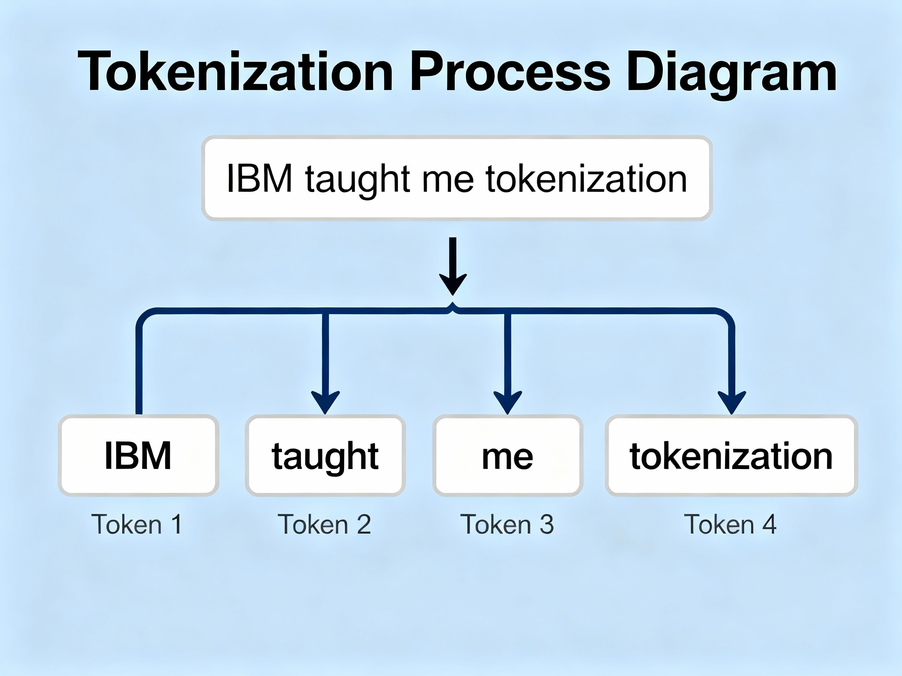
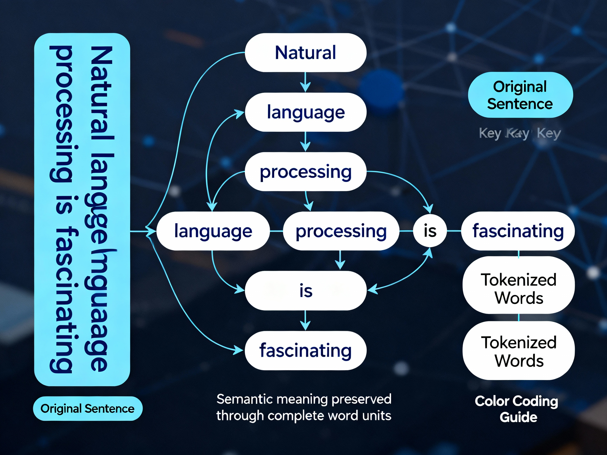
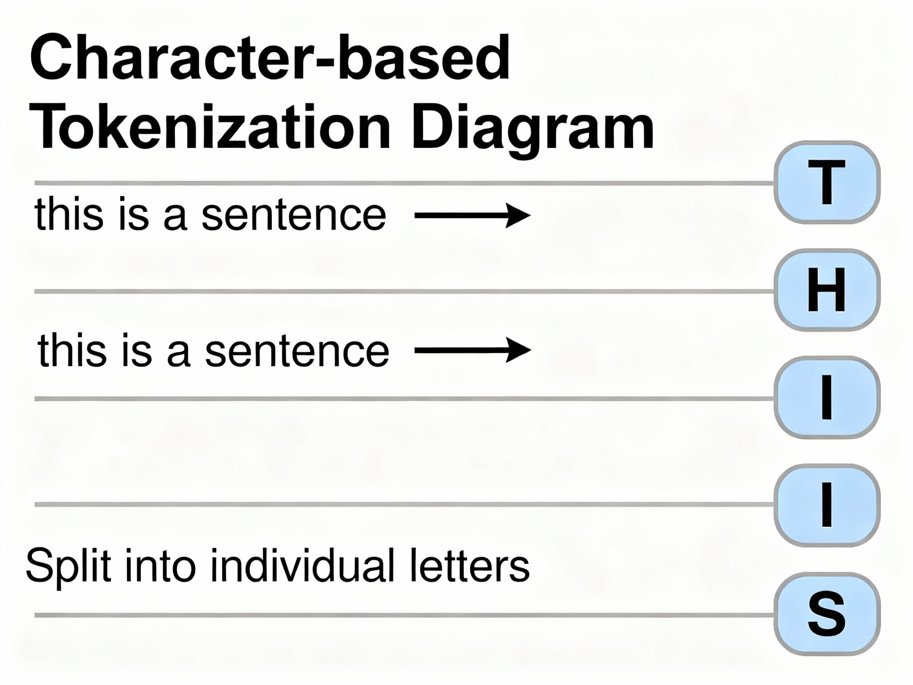
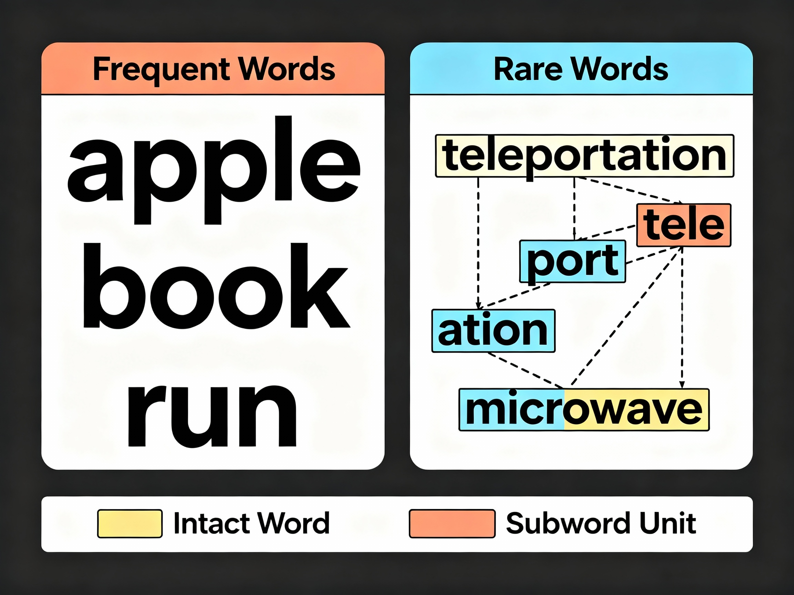
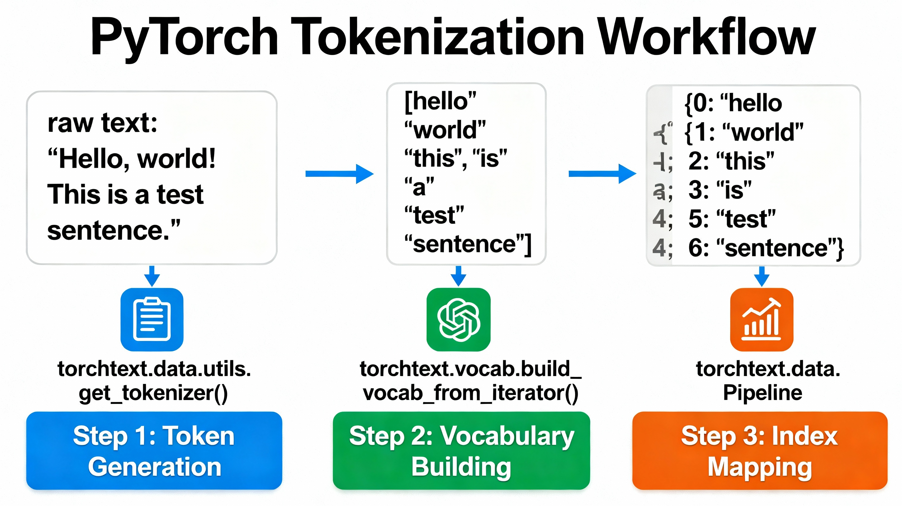
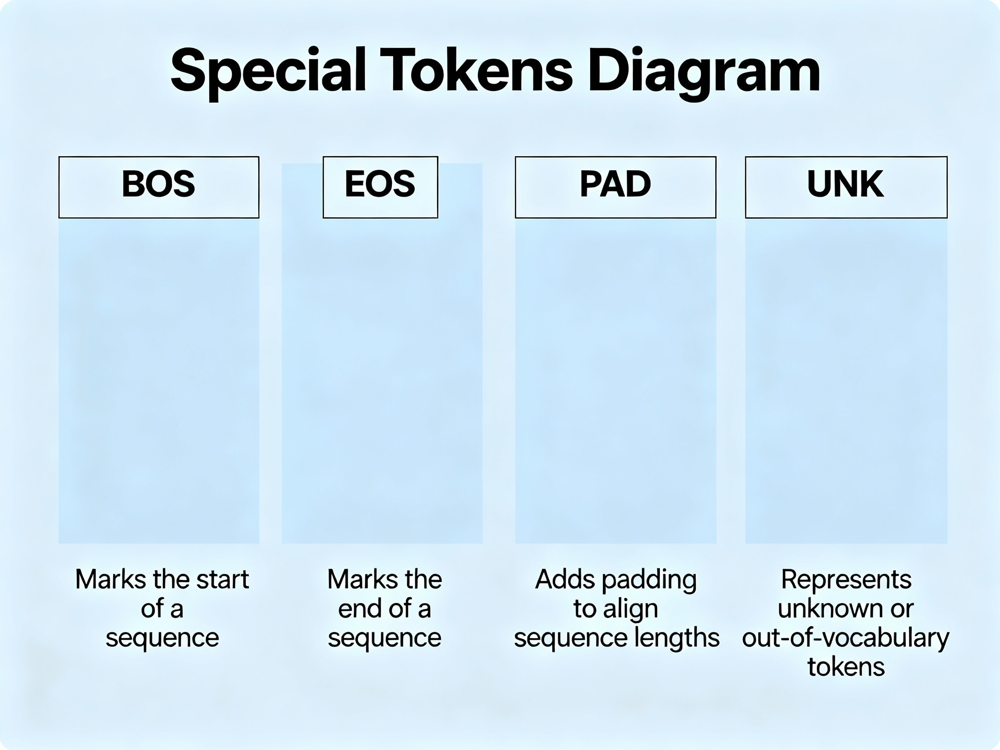

## Generative AI Data Preparation: Module 2 - Tokenization

### Introduction to Tokenization

**Tokenization** is the foundational process of breaking down text into smaller, meaningful pieces called **tokens**, enabling AI models to understand and process textual data. This critical data preparation step transforms raw, unstructured text into structured units that machine learning models can interpret and analyze.

In the context of sentiment analysis, for example, an AI model must identify and extract keywords such as "good" and "bad" from user feedback to determine sentiment. This requires breaking down user-provided text into meaningful parts through tokenization.

### Core Concept: What is Tokenization?

For a sentence like "**IBM taught me tokenization**," the tokens would be: **IBM**, **taught**, **me**, and **tokenization**. Each token represents a discrete unit of meaning that the model can process.

The program responsible for breaking down text into individual tokens is called a **tokenizer**. Different AI models might use different types of tokens depending on their architecture and purpose.



Example of Tokenization Breaking Sentence into Individual Tokens

### Three Primary Tokenization Methods

Tokenizers generate tokens primarily through three distinct tokenization approaches, each with unique characteristics, advantages, and limitations:
| Method          | Tokenization Unit             | Vocabulary Size               | Key Advantages                                                                                                                                      | Key Disadvantages                                                                                                                                        | Example Tools                                    | Best Use Cases                                                                  |
| --------------- | ----------------------------- | ----------------------------- | --------------------------------------------------------------------------------------------------------------------------------------------------- | -------------------------------------------------------------------------------------------------------------------------------------------------------- | ------------------------------------------------ | ------------------------------------------------------------------------------- |
| Word-based      | Individual words              | Large                         | Preserves semantic meaning; Words remain intact and interpretable; Clear word boundaries                                                            | Significantly increases model vocabulary; Treats similar words (unicorn/unicorns) as different; Out-of-vocabulary issues; Limited handling of rare words | NLTK tokenizer, spaCy tokenizer                  | Traditional NLP tasks; Semantic preservation critical; Document classification  |
| Character-based | Individual characters         | Small (Limited character set) | Very small vocabulary size; No out-of-vocabulary issues; Can handle any text                                                                        | Single characters don't convey meaning; Increases input dimensionality significantly; Higher computational needs; Loss of semantic information           | Custom character tokenizers                      | Low-resource languages; Handling typos and variations; Character-level modeling |
| Subword-based   | Words and meaningful subwords | Medium (Balanced)             | Combines benefits of word and character methods; Frequent words stay unsplit; Rare words broken into meaningful parts; Handles unknown words better | More complex implementation; Requires training subword vocabulary                                                                                        | WordPiece (BERT), Unigram (XLNet), SentencePiece | Modern transformer models; Multilingual models; Morphologically rich languages  |

Comprehensive Comparison of Tokenization Methods

#### 1. Word-based Tokenization

In word-based tokenization, text is divided into individual words, with each complete word considered a single token.

**Mechanism**: The tokenizer splits text at whitespace and punctuation boundaries, treating each resulting word as a separate token. For example, "The cat sat" becomes three tokens: ["The", "cat", "sat"].

**Advantages**:

- **Preserves semantic meaning**: Words remain intact and interpretable
- Clear word boundaries make it intuitive and straightforward
- Tokens correspond directly to linguistic units

**Disadvantages**:

- **Significantly increases model vocabulary**: Every unique word form becomes a separate token
- **Morphological variations treated as different tokens**: Similar words like "unicorn" and "unicorns" are treated as completely different tokens, leading to issues during natural language processing tasks
- Cannot handle out-of-vocabulary words effectively
- Large vocabulary size increases memory requirements and computational costs

**Common Tools**:

- **NLTK tokenizer**: Splits sentences effectively but treats morphological variants separately
- **spaCy tokenizer**: Provides sophisticated word-level tokenization with linguistic awareness

**Use Cases**: Traditional NLP tasks, document classification, when semantic preservation is critical.



Word-based Tokenization Preserving Semantic Meaning of Complete Words

#### 2. Character-based Tokenization

Character-based tokenization involves splitting text into individual characters, treating each character as a unique token.

**Mechanism**: Every single character becomes its own token. For example, the input text "This is a sentence" after tokenization becomes: **T**, **H**, **I**, **S**, and so on.

**Advantages**:

- **Very small vocabulary size**: Limited to the character set (typically <100 tokens for English)
- **No out-of-vocabulary issues**: Can represent any text with the base character set
- Can handle typos, misspellings, and variations naturally

**Disadvantages**:

- **Single characters don't convey semantic information**: Individual characters lack the meaning that complete words provide
- **Increases input dimensionality significantly**: Sentences become much longer sequences
- **Higher computational needs**: Models must learn to combine characters into meaningful units
- Loss of inherent word-level semantic structure

**Use Cases**: Low-resource languages, handling typos and spelling variations, character-level language modeling, morphologically rich languages.



Character-based Tokenization Splitting Text into Individual Characters

#### 3. Subword-based Tokenization

Subword-based tokenization represents a hybrid approach that combines the advantages of both word-based and character-based methods. Frequently used words remain unsplit, while infrequent words are broken down into meaningful subword units.

**Mechanism**: The tokenizer learns a vocabulary of frequent whole words and meaningful subword pieces. Common words stay intact, while rare words are decomposed into recognizable components. For example, "tokenization" might be split into "token" + "\#\#ization" in WordPiece notation.

**Advantages**:

- **Balanced approach**: Combines benefits of word-based and character-based tokenization
- **Handles rare words effectively**: Unknown words can be represented through subword combinations
- **Moderate vocabulary size**: Neither too large (like word-based) nor too small (like character-based)
- Captures morphological relationships naturally

**Disadvantages**:

- More complex implementation requiring algorithm-specific training
- Requires building and maintaining subword vocabulary



Subword-based Tokenization Combining Word and Character Approach

### Subword Tokenization Algorithms

There are various algorithms for implementing subword-based tokenization, each with distinct approaches and characteristics:

| Algorithm     | Core Approach/Strategy                         | How It Works                                                                                                                           | Symbol Notation                                                                 | Used In                                                                     | Key Characteristic                                   |
| ------------- | ---------------------------------------------- | -------------------------------------------------------------------------------------------------------------------------------------- | ------------------------------------------------------------------------------- | --------------------------------------------------------------------------- | ---------------------------------------------------- |
| WordPiece     | Benefit-based splitting and merging            | Evaluates benefits and drawbacks of splitting/merging two symbols to ensure valuable decisions; Greedy algorithm maximizing likelihood | ## prefix indicates attachment to previous word without space (e.g., ##ization) | BERT, DistilBERT, Electra                                                   | Greedy algorithm maximizing training data likelihood |
| Unigram       | Iterative narrowing from large vocabulary      | Begins with large list of possibilities and gradually narrows down based on frequency in text through iterative process                | _ prefix indicates new words preceded by space (e.g., _token, _ization)         | XLNet, ALBERT, T5                                                           | Probabilistic model selecting optimal subword units  |
| SentencePiece | Language-agnostic segmentation with unique IDs | Segments text into manageable parts and assigns unique IDs; Works directly on raw text without pre-tokenization                        | Can work with both WordPiece and Unigram algorithms as backend                  | Universal framework for multiple models; XLNet; ALBERT; Multilingual models | Language-independent; No pre-tokenization required   |

Comparison of Subword Tokenization Algorithms

#### WordPiece Algorithm

**Core Approach**: WordPiece evaluates the benefits and drawbacks of splitting and merging two symbols to ensure its decisions are valuable. It operates as a greedy algorithm that maximizes the likelihood of the training data.

**Notation System**: The \#\# symbol before a word indicates that the word should be attached to the previous word without a space. For example, "tokenization" might be represented as "token" + "\#\#ization".

**Implementation Example**: The code snippet utilizes the Transformers library to import pre-trained BERT tokenizer (Bidirectional Encoder Representations from Transformers), which uses WordPiece:

```python
from transformers import BertTokenizer
tokenizer = BertTokenizer.from_pretrained('bert-base-uncased')
```

**Used In**: BERT, DistilBERT, Electra models.

#### Unigram Algorithm

**Core Approach**: The Unigram algorithm breaks text into smaller pieces through an iterative process. It begins with a large list of possible subword units and gradually narrows down the vocabulary based on how frequently they appear in the text.

**Notation System**: Tokens are **prefixed with an underscore (_)** to indicate they are new words preceded by a space in the original text. Tokens without the prefix directly follow the preceding word without a space. For example, "_token" + "ization" indicates "token" starts a new word while "ization" continues it.

**Implementation Example**: The code snippet uses the Transformers library to import XLNetTokenizer, which uses Unigram:

```python
from transformers import XLNetTokenizer
tokenizer = XLNetTokenizer.from_pretrained('xlnet-base-cased')
```

**Used In**: XLNet, ALBERT, T5 models.

#### SentencePiece Algorithm

**Core Approach**: SentencePiece segments text into manageable parts and assigns unique IDs. Unlike other tokenizers, it works directly on raw text without requiring pre-tokenization or language-specific preprocessing.

**Key Characteristic**: SentencePiece is **language-agnostic** and can work with both WordPiece and Unigram algorithms as its backend. This makes it particularly valuable for multilingual models and languages without clear word boundaries.

**Used In**: Universal framework employed across multiple models including XLNet, ALBERT, and various multilingual models.

### Tokenization and Indexing in PyTorch

PyTorch provides comprehensive tools for tokenization through the **torchtext** library, enabling conversion of text into numerical representations that models can process.



PyTorch Tokenization Workflow with TorchText Library

#### Core PyTorch Tokenization Workflow

**Step 1: Tokenization**
In PyTorch, you use the torchtext library to tokenize text from a dataset into individual words or subwords. The `get_tokenizer` function creates a tokenizer that can be applied to text:

```python
from torchtext.data.utils import get_tokenizer
tokenizer = get_tokenizer('basic_english')
```

The tokenizer is applied to text to generate tokens as a list.

**Step 2: Vocabulary Building**
Use the `build_vocab_from_iterator` function to create a vocabulary from tokens that the model can understand. This function assigns each token in the vocabulary a unique index represented by an integer:

```python
from torchtext.vocab import build_vocab_from_iterator

def yield_tokens(data_iter):
    for text in data_iter:
        yield tokenizer(text)

vocab = build_vocab_from_iterator(yield_tokens(dataset))
```

The code defines a function called `yield_tokens` that takes a data iterator as input. Inside this function, it processes each text from the data iterator using a tokenizer and yields the tokenized output individually.

**Step 3: Token-to-Index Mapping**
The model uses these indices to map words in the vocabulary. The `vocab.get_stoi()` method provides a dictionary that maps words to their corresponding numerical indices in the vocabulary.

You can apply the vocab function to tokens directly or to a list of tokens, resulting in a list of numerical indices:

```python
indices = [vocab[token] for token in tokens]
```


#### Handling Unknown Tokens (UNK)

Sometimes you will have an **unknown token (UNK)** that serves as a special token for words that might not be in your vocabulary. The line `vocab.set_default_index(vocab["<unk>"])` sets `<unk>` as the default word if a word is not found in the vocabulary.

This ensures the model can handle out-of-vocabulary words gracefully without errors.

#### Complete PyTorch Example

Consider an example workflow applying the vocab function to tokens directly:

1. The function `get_tokenized_sentence_and_indices` takes an iterator as input and applies the vocab function to tokens directly
2. The next tokenized sentence is extracted from the iterator
3. A list of token indices is created using the vocab dictionary for each token in the tokenized sentence
4. The code returns both the tokenized sentence and its corresponding token indices
5. The print command displays the tokenized sentence and its corresponding token indices

This process can be repeated for entire datasets, converting textual data into numerical format for model training.

### Special Tokens in Tokenization

In many applications, you'll need to add **special tokens** that provide additional information about sequence structure and boundaries:



Special Tokens Used in Tokenization for Sequence Processing

#### Common Special Tokens

**BOS (Beginning of Sequence)**: Indicates the start of a text sequence. Using spaCy, you can tokenize each sentence and add BOS tokens by appending them at the beginning of the tokenized sentence using a loop that iterates over sentences in the input data.

**EOS (End of Sequence)**: Marks the end of a text sequence. These tokens are appended at the end of tokenized sentences, helping models understand where sequences terminate.

**PAD (Padding)**: Subsequently, you can pad the tokenized lines with PAD tokens to ensure that all sentences have the same length, matching the length of the longest sentence among the input sentences. This is essential for batch processing in neural networks.

**UNK (Unknown)**: Represents words not found in the vocabulary, as discussed previously.

#### Implementation of Special Tokens

```python
import spacy

nlp = spacy.load('en_core_web_sm')

tokenized_sentences = []
for sentence in sentences:
    tokens = ['<BOS>'] + [token.text for token in nlp(sentence)] + ['<EOS>']
    tokenized_sentences.append(tokens)

# Padding to match longest sentence
max_length = max(len(s) for s in tokenized_sentences)
padded_sentences = [s + ['<PAD>'] * (max_length - len(s)) 
                    for s in tokenized_sentences]
```

This ensures uniform sequence lengths for efficient batch processing while maintaining structural information about sequence boundaries.

### Tokenization in Practice: Key Considerations

#### Vocabulary Size Management

The choice of tokenization method directly impacts vocabulary size:

- **Word-based**: 10,000 to 100,000+ tokens (large)
- **Character-based**: 50-300 tokens (small)
- **Subword-based**: 8,000-32,000 tokens (balanced)

Larger vocabularies increase memory requirements and embedding layer sizes, while smaller vocabularies may lose semantic granularity.

#### Model Compatibility

Different pre-trained models expect specific tokenization approaches:

- **BERT**: WordPiece tokenization with \#\# notation
- **GPT-2/GPT-3**: Byte-Pair Encoding (BPE) subword tokenization
- **XLNet**: Unigram with SentencePiece
- **T5**: SentencePiece with unified text-to-text format

Using the correct tokenizer for each model architecture is essential for proper functioning.

#### Computational Trade-offs

- **Word-based**: Fast tokenization but large vocabulary overhead
- **Character-based**: Slow due to long sequences but minimal vocabulary
- **Subword-based**: Balanced computational cost with optimal representation


### Complete Tokenization Pipeline

A comprehensive tokenization pipeline for generative AI data preparation follows these steps:

1. **Raw Text Input**: Collect and clean text data
2. **Pre-processing**: Normalize text (lowercase, remove special characters if needed)
3. **Tokenization**: Apply chosen tokenization method (word/character/subword)
4. **Special Token Addition**: Add BOS, EOS, and other structural tokens
5. **Vocabulary Building**: Create or load pre-existing vocabulary
6. **Token-to-Index Conversion**: Map tokens to numerical indices
7. **Padding**: Ensure uniform sequence lengths for batch processing
8. **Tensor Conversion**: Convert to PyTorch/TensorFlow tensors for model input

This pipeline transforms unstructured text into structured numerical representations suitable for training generative AI models.

### Summary

Tokenization represents the critical first step in generative AI data preparation, transforming raw text into structured tokens that models can process. The three primary tokenization methods—word-based, character-based, and subword-based—each offer distinct advantages suited to different applications. Word-based tokenization preserves semantic meaning but increases vocabulary size significantly. Character-based tokenization minimizes vocabulary but loses word-level semantics and increases sequence length. Subword-based tokenization provides the optimal balance, combining the strengths of both approaches through algorithms like WordPiece, Unigram, and SentencePiece.

Modern transformer-based models predominantly use subword tokenization, with BERT employing WordPiece and XLNet using Unigram with SentencePiece. PyTorch's torchtext library provides comprehensive tools for implementing tokenization workflows, including vocabulary building, index mapping, and special token handling. Proper tokenization strategy selection and implementation directly impacts model performance, vocabulary efficiency, and computational requirements, making it an essential consideration in generative AI development.